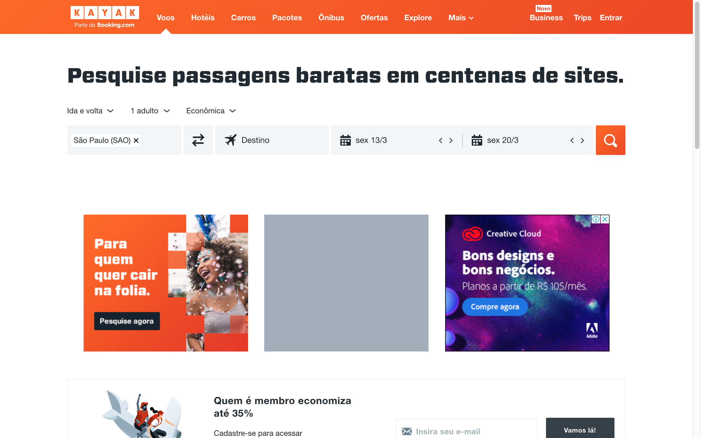
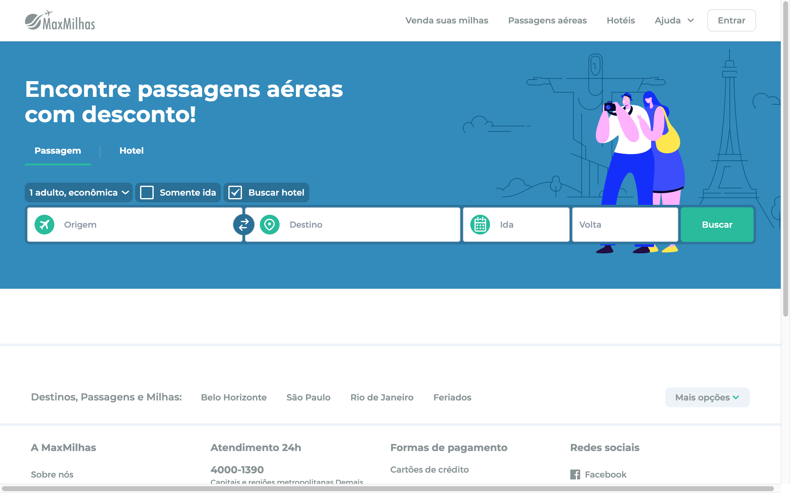
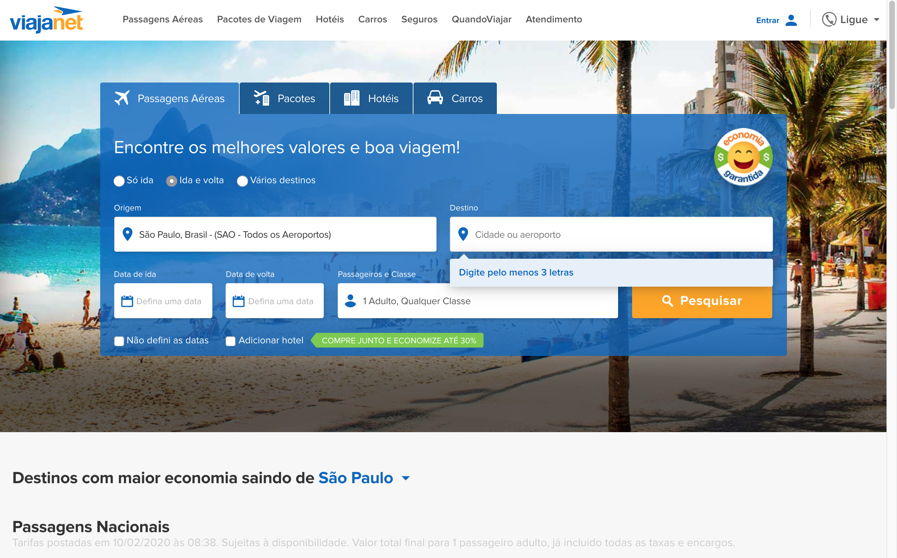

# Desafio Estágio - Tegra + Heroway

<link rel="shortcut icon" type="image/x-icon" href="tegra.ico">

Bem vindo ao Desafio para estágio na Tegra.

Essa desafio é focado no desenvolvimento front-end, segundo conteúdo ministrado pela Heroway.


## Objetivo

Desenvolver uma Single Page Application (SPA) para a busca de voos.

## Requisitos

Sua aplicação deve:

- Ser desenvolvida em React
- Conter uma tela onde o usuário possa selecionar o `Aeroporto de Origem`, `Aeroporto de Destino`, `Data de Saída`, através de Dropdowns ou Pickers
- Exibir, após a busca, a lista de voos, sejam eles diretos ou com escalas
- Possibilitar a ordenação por Preço Total ou por Tempo Total de voo
- Calcular o preço total e o tempo total de voo, considerando as esperas entre as escalas

## API para requisição aos dados

Temos disponível a seguinte API para a requisição dos dados

- A lista de aeroportos pode ser obtida com um GET da URL `https://api-voadora.dev.tegra.com.br/flight/companies`
- A lista de voos por dia é um POST na `https://api-voadora.dev.tegra.com.br/flight`, com o Body seguindo este padrão em JSON:

  ```json
  {
    "from": "BSB",
    "to": "VCP",
    "date": "2019-02-10"
  }
  ```

- **ATENÇÃO:** Só existem dados na API do intervalo do dia 10/02/2019 ao dia 18/02/2019

## Extras

Caso deseje, você pode incluir no seu teste outros recursos que julgar necessário. Abaixo temos alguns exemplos, mas não fique limitado a eles:

- Typescript
- RxJs
- Redux
- CSS customizado

## Entrega

A entrega deve ser feita em um repositório no Github, público. Que deve conter:

- O código do projeto
- Um arquivo **README** que descreva as etapas e dependências para rodar o projeto

**TODO: definir o email para que o candidato envie o projeto finalizado**

Não se preocupe se não conseguir entregar todos os requisitos: dê o seu melhor! :muscle:

## Exemplos de interfaces

Para inspirar o desenvolvimento da tela, aqui estão alguns exemplos de interfaces:






